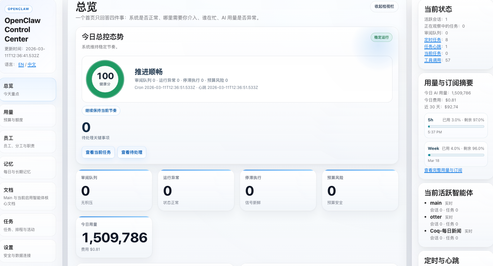

# OpenClaw Command Center

OpenClaw Command Center is a public overlay package for the OpenClaw control UI. It wraps the native `<openclaw-app>` experience with a Mission Control shell, an overview page, and an optional local helper process for diagnostics and host-side service visibility.



## Positioning

This repository is not a replacement backend for OpenClaw.
It is a conservative integration layer that:

- reuses the upstream OpenClaw frontend runtime
- adds your custom command center pages and shell
- keeps host-side helper scripts outside the container
- favors generated patches over rewriting the user's full setup

`v0.1.0` is aimed at:

- Windows hosts
- Docker-based OpenClaw deployments
- mounting a generated UI to `/custom-ui`

## What Is Included

- `shell/`: overlay templates and custom assets
- `scripts/`: helper service and Windows helper bootstrap scripts
- `examples/`: minimal config patch and compose override examples
- `docs/`: release notes, packaging notes, and integration guides
- `install.sh`: extract the upstream control UI from a running container and overlay the command center
- `install.ps1`: Windows-first installer for extracting the UI into an OpenClaw project and wiring helper files

## Recommended Install Paths

### Windows host + existing OpenClaw repo

Use the PowerShell installer. It is the most complete path for the first public release.

```powershell
.\install.ps1 `
  -OpenClawRoot D:\coding\my-openclaw `
  -WriteDockerOverride `
  -WriteEnvExample
```

What it does:

- validates the target OpenClaw project
- extracts the upstream control UI from a running OpenClaw container
- detects the current hashed runtime asset names
- writes the rendered command center UI into `<OpenClawRoot>\custom-ui`
- copies helper scripts into `<OpenClawRoot>\scripts`
- writes `openclaw.command-center.patch.json`
- optionally writes `docker-compose.command-center.override.yml`
- optionally updates `.env.example`
- optionally registers helper autostart

### Bash / Git Bash / Linux / macOS

Use the shell installer when you want to build a distributable overlay directory directly from a running container.

```bash
git clone https://github.com/yourname/openclaw-command-center.git
cd openclaw-command-center
./install.sh -o ./dist
```

Or generate straight into an OpenClaw project:

```bash
./install.sh -c david -o /path/to/openclaw/custom-ui
```

What it does:

1. Copies the upstream OpenClaw control UI out of the running container.
2. Detects the current hashed runtime asset names.
3. Renders `index.html` and `mission-control-overview.html`.
4. Overlays the custom shell, pages, and static assets.

## After Installation

Merge the generated patch into your OpenClaw config:

```json
{
  "gateway": {
    "controlUi": {
      "root": "/custom-ui"
    }
  }
}
```

Mount the generated UI directory into your OpenClaw container. Example:

```yaml
services:
  david:
    volumes:
      - ./custom-ui:/custom-ui
```

Then restart your OpenClaw deployment.

## Helper

The helper is a host-side process. It is intentionally not bundled into the container.

Relevant files:

- `scripts/command-center-helper.mjs`
- `scripts/ensure-command-center-helper.ps1`
- `scripts/install-command-center-helper-autostart.ps1`

Default endpoints:

- `http://127.0.0.1:3211/health`
- `ws://127.0.0.1:3211/ws`

## AI Quickstart

If you want another coding agent to integrate this package into an existing OpenClaw deployment, use [docs/AI-QUICKSTART.md](docs/AI-QUICKSTART.md).

That guide is written as an explicit, step-by-step integration contract for agentic tools.

## Known Boundaries

- The helper flow is currently Windows-first.
- `mission-control-overview.html` depends on the upstream OpenClaw frontend runtime.
- The package avoids shipping upstream runtime chunks directly; installers copy them from the user's own running OpenClaw environment.

## License

MIT